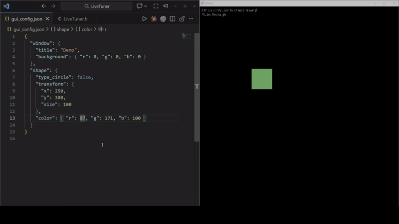

<div align="center">

# 🎚️ CppLiveTuner

### **値を変えるたびに、再コンパイルしていませんか？**

*ビルド待ち時間をゼロにする、パラメータ調整の特効薬*

[](https://opensource.org/licenses/MIT)
[](https://isocpp.org/std/the-standard)
[](https://en.wikipedia.org/wiki/Header-only)
[]()

**C++向けライブパラメータチューニングライブラリ**  
*設定ファイルを編集 → 実行中のプログラムに即座に反映。再ビルド不要。*

[📖 English Documentation](README.md)

</div>

---

## ✨ なぜCppLiveTunerなのか？

たった1つの値を変えるために、**編集 → コンパイル → 実行 → 確認 → 繰り返し**のサイクルにうんざりしていませんか？

```
❌ 従来のワークフロー:
   値を変更 → 再コンパイル (30秒～) → 再起動 → テスト → 繰り返し...

✅ CppLiveTunerなら:
   値を変更 → ファイル保存 → 即座に結果を確認！
```

**CppLiveTunerはパラメータ調整のための再コンパイルを完全に排除します。** ゲームの物理演算、シェーダーの値、UIアニメーションなど、何を調整していても、結果をリアルタイムで確認できます。

### 🎯 こんな用途に最適

| 用途 | 例 |
|------|-----|
| 🎮 **ゲーム開発** | プレイしながらジャンプ高さ、移動速度、スポーン率を調整 |
| 🎨 **グラフィックス/シェーダー** | 露出、ブルーム、カラーグレーディングをリアルタイムで調整 |
| 🤖 **ロボティクス/シミュレーション** | PIDパラメータ、センサー閾値をライブ調整 |
| 🔧 **デバッグ/プロファイリング** | デバッグ表示のトグル、ログレベルをその場で変更 |

---

## 🚀 特徴

| 機能 | 説明 |
|------|------|
| ⚡ **再コンパイル不要** | プログラム実行中にパラメータを変更可能 |
| 🔌 **ヘッダーオンリー** | 1ファイル、依存関係なし。`#include`するだけ |
| 🛡️ **STBスタイル** | `Windows.h`汚染なし |
| 🎯 **ノンブロッキングAPI** | ゲームループやリアルタイムアプリに最適 |
| 📝 **複数フォーマット対応** | JSON、YAML、INI、プレーンテキスト |
| 👁️ **イベント駆動型監視** | ネイティブOS API (inotify/FSEvents/ReadDirectoryChanges) |
| 🧵 **スレッドセーフ** | 完全なミューテックス保護 |
| 🌐 **クロスプラットフォーム** | Windows, Linux, macOS |
| 🧪 **テスト可能な設計** | DI対応、モックインターフェース、テストフィクスチャ |
| 📚 **nlohmann/json対応** | nlohmann/jsonユーザー向けオプションアダプター |

---

## 🎬 デモ

<div align="center">



*設定ファイルを編集 → 実行中のプログラムに即座に反映！*

</div>

---

## 📦 インストール

**1ファイルをコピーするだけ** — 以上！

```bash
# 方法1: 直接コピー
cp LiveTuner.h /your/project/include/

# 方法2: Gitサブモジュール
git submodule add https://github.com/andogensi/CppLiveTuner.git vendor/CppLiveTuner
```

---

## 🏁 クイックスタート

### 1️⃣ セットアップ (STBスタイル・ヘッダーオンリー)

```cpp
// main.cpp (または専用の1ファイル)
#define LIVETUNER_IMPLEMENTATION
#include "LiveTuner.h"
```

```cpp
// 他のすべてのファイル — インクルードするだけ、Windows.h汚染なし！
#include "LiveTuner.h"
```

### 2️⃣ シンプルな使い方 — 単一値

```cpp
#define LIVETUNER_IMPLEMENTATION
#include "LiveTuner.h"

int main() {
    float speed = 1.0f;
    
    while (running) {
        tune_try(speed);         // ← params.txtをチェック、変更があれば更新
        player.move(speed);
    }
}
```

**実行中に `params.txt` を編集:**
```
2.5
```
→ `speed` が即座に `2.5` に！ 🎉

### 3️⃣ 推奨の使い方 — 名前付きパラメータ

```cpp
#define LIVETUNER_IMPLEMENTATION
#include "LiveTuner.h"

int main() {
    livetuner::Params params("config.json");
    
    float speed = 1.0f;
    float gravity = 9.8f;
    bool debug = false;
    
    // 変数をバインド — ファイルが変更されると自動更新！
    params.bind("speed", speed, 1.0f);
    params.bind("gravity", gravity, 9.8f);
    params.bind("debug", debug, false);
    
    while (running) {
        params.update();         // ← バインドされた全変数が自動更新！
        
        player.move(speed);
        physics.setGravity(gravity);
        if (debug) showDebugInfo();
    }
}
```

**実行中に `config.json` を編集:**
```json
{
    "speed": 2.5,
    "gravity": 15.0,
    "debug": true
}
```
→ 3つの値すべてが即座に更新！ 🚀

---

## 🔨 ビルド

```bash
# GCC / MinGW (C++17以降)
g++ -std=c++17 your_program.cpp -I include -o program

# MSVC (C++17以降)
cl /std:c++17 your_program.cpp /I include

# Linux (pthread必須)
g++ -std=c++17 your_program.cpp -I include -pthread -o program
```

---

## 📖 APIリファレンス

### シンプルAPI — 単一値チューニング

| 関数 | 説明 |
|------|------|
| `tune_init(path)` | パラメータファイルを設定 (デフォルト: `params.txt`) |
| `tune_try(value)` | **ノンブロッキング**: 変更があれば更新、更新時は`true`を返す |
| `tune(value)` | **ブロッキング**: 値が取得できるまで待機 |
| `tune_timeout(value, dur)` | タイムアウト時は`false`を返す |
| `tune_async<T>()` | `std::future<T>`を返す |
| `tune_async<T>(callback)` | コールバック付き非同期 |
| `tune_set_event_driven(bool)` | イベント駆動モードの有効/無効 |

### Params API — 名前付きパラメータ

| 関数 | 説明 |
|------|------|
| `Params(path, format)` | コンストラクタ (format: Auto/Json/Yaml/KeyValue/Plain) |
| `bind(name, var, default)` | 変数をパラメータにバインド |
| `update()` | **ノンブロッキング**: 変更があれば全バインドを更新 |
| `get<T>(name)` | `std::optional<T>`として取得 |
| `get_or<T>(name, default)` | デフォルト値付きで取得 |
| `on_change(callback)` | 変更コールバックを設定 |
| `start_watching()` / `poll()` | バックグラウンドファイル監視 |

---

## 📁 サポートするファイルフォーマット

| フォーマット | 拡張子 | 例 |
|-------------|--------|-----|
| **JSON** | `.json` | `{"speed": 1.5, "debug": true}` |
| **YAML** ⚠️ | `.yaml`, `.yml` | `speed: 1.5` |
| **INI** | `.ini`, `.cfg` | `speed = 1.5` |
| **プレーンテキスト** | `.txt` | `1.5` |

> ⚠️ **YAML制限事項**: シンプルな `key: value` 形式のみ対応。**ネストされたオブジェクト、配列、高度なYAML機能は非対応。** 詳細は下記参照。

<details>
<summary>📄 フォーマット例 (クリックで展開)</summary>

### JSON
```json
{
    "speed": 1.5,
    "gravity": 9.8,
    "debug": true
}
```

### ⚠️ YAML (シンプルなKey-Value形式のみ)

> [!WARNING]
> **CppLiveTunerは完全なYAMLパーサーではありません！**
> 
> シンプルな `key: value` 形式のみ対応しています。ネストされたオブジェクト、配列、複数行文字列、その他の高度なYAML機能は**エラーなく無視されるか、予期しない結果を生成します**。
> 
> **複雑な設定にはJSONを使用してください。**

**✅ サポートあり:**
```yaml
# コメントはサポート
speed: 1.5
gravity: 9.8
debug: true
name: "player1"
---
# ドキュメントマーカーは無視される
```

**❌ サポートなし:**
```yaml
# ネストされた構造
player:
  speed: 1.5      # ❌ ネストされたオブジェクトは非対応
  position:
    x: 100        # ❌ 多階層ネストは非対応

# 配列/リスト
items:            # ❌ 配列は非対応
  - sword
  - shield

scores: [1, 2, 3] # ❌ インライン配列は非対応

# 複数行文字列
description: |    # ❌ ブロックスカラーは非対応
  This is a
  multi-line text

# アンカーとエイリアス
defaults: &defaults  # ❌ アンカーは非対応
  speed: 1.0
```

**💡 完全なYAMLサポートが必要な場合**  
JSON形式を使用するか、完全なYAMLパーサーライブラリ（yaml-cppなど）を統合し、CppLiveTunerに渡す前にJSONに変換してください。

### INI / キーバリュー形式
```ini
speed = 1.5
gravity = 9.8
debug = true
```

### プレーンテキスト
```
1.5
```
</details>

---

## ⚡ イベント駆動型ファイル監視

CppLiveTunerは最大の効率を実現するために**ネイティブOS API**を使用:

| OS | API | レイテンシ |
|----|-----|-----------|
| Windows | `ReadDirectoryChangesW` | ~1ms |
| Linux | `inotify` | ~1ms |
| macOS | `FSEvents` | ~1ms |

### ポーリング vs イベント駆動

| | ポーリング 🐢 | イベント駆動 ⚡ |
|---|---|---|
| **CPU使用率** | 高い (常時) | ほぼゼロ |
| **レイテンシ** | 50-100ms | リアルタイム |
| **SSDへの影響** | 経年劣化あり | なし |

---

## 🎮 実際の使用例

### ゲーム開発
```cpp
float jump_height = 10.0f, move_speed = 5.0f;
params.bind("jump_height", jump_height);
params.bind("move_speed", move_speed);

while (game_running) {
    params.update();
    player.jump(jump_height);    // プレイしながら調整！
    player.move(move_speed);
}
```

### シェーダー/グラフィックスチューニング
```cpp
float exposure = 1.0f, bloom = 0.8f;
params.bind("exposure", exposure);
params.bind("bloom_threshold", bloom);

while (rendering) {
    params.update();
    shader.setUniform("exposure", exposure);
    shader.setUniform("bloom", bloom);
}
```

### デバッグトグル
```cpp
bool show_fps = true, show_hitboxes = false;
params.bind("show_fps", show_fps);
params.bind("show_hitboxes", show_hitboxes);

params.on_change([]() {
    std::cout << "デバッグ設定が変更されました！\n";
});
```

---

## 🧪 テスト可能な設計

CppLiveTunerはエンタープライズグレードのテスト可能性のために**依存性注入**をサポート。

<details>
<summary>🔧 テストパターン (クリックで展開)</summary>

### ユニットテスト用TestFixture
```cpp
TEST(MyTest, TestSomething) {
    livetuner::TestFixture fixture;  // 状態を自動リセット
    tune_init("test.txt");
    // テストは分離して実行
}
```

### インターフェースベースのDI
```cpp
class ConfigManager {
    livetuner::IParams& params_;
public:
    explicit ConfigManager(livetuner::IParams& p) : params_(p) {}
    float get_speed() { return params_.get_or("speed", 1.0f); }
};

// 本番環境
livetuner::Params real_params("config.json");
livetuner::ParamsAdapter adapter(real_params);
ConfigManager config(adapter);

// モックでテスト
class MockParams : public livetuner::IParams { /* ... */ };
```

### 並列テスト用ScopedContext
```cpp
void test_thread_1() {
    livetuner::LiveTuner tuner("test1.txt");
    livetuner::ScopedContext ctx(tuner, params);
    game_loop();  // test1.txtを使用 (スレッドローカル)
}
```
</details>

---

## ⚙️ 高度な設定

<details>
<summary>プリプロセッサオプション (クリックで展開)</summary>

### 外部picojson
```cpp
#define LIVETUNER_USE_EXTERNAL_PICOJSON
#include "picojson.h"
#include "LiveTuner.h"
```

### nlohmann/json サポート
```cpp
#define LIVETUNER_USE_NLOHMANN_JSON
#include <nlohmann/json.hpp>
#define LIVETUNER_IMPLEMENTATION
#include "LiveTuner.h"

livetuner::NlohmannParams params("config.json");
```

### Windows.h 設定
```cpp
#define LIVETUNER_NO_WIN32_LEAN  // 完全なWindows.hを保持
#define LIVETUNER_NO_NOMINMAX    // min/maxマクロを保持
#include "LiveTuner.h"
```

### ロギング制御
```cpp
// デフォルトのstderrロギングを無効化
#define LIVETUNER_ENABLE_DEFAULT_LOGGING 0
#include "LiveTuner.h"

// またはカスタムロガーを使用
livetuner::set_log_callback([](LogLevel lvl, const std::string& msg) {
    MyEngine::Log(lvl, msg);
});
```
</details>

---

## 📂 プロジェクト構成

```
CppLiveTuner/
├── include/
│   └── LiveTuner.h          # 🎯 メインヘッダー (これをインクルードするだけ！)
├── examples/
│   └── example.cpp          # 使用例
├── Test/                    # 包括的なテストスイート
├── cmake/                   # CMakeサポートファイル
└── README.md
```

---

## ❓ トラブルシューティング

| 問題 | 解決策 |
|------|--------|
| ファイルが検出されない | 絶対パスを使用、アクセス権限を確認 |
| 値が更新されない | JSON構文を確認、`update()`が呼ばれているか確認 |
| ビルドエラー | C++17を有効に: `-std=c++17` または `/std:c++17` |

---

## 🤝 コントリビューション

コントリビューション歓迎！お気軽に:
- 🐛 バグを報告
- 💡 機能を提案
- 🔧 プルリクエストを送信

---

## 📜 ライセンス

**MITライセンス** — 個人・商用利用問わず無料。

このプロジェクトには以下のサードパーティコンポーネントが含まれています：
- **picojson** (LiveTuner.h に埋め込み) — BSD 2-Clause License © Kazuho Oku, Cybozu Labs, Inc.
- **nlohmann/json** (Json.hpp, オプション) — MIT License © Niels Lohmann

詳細は [LICENSE](LICENSE) を参照してください。

---

<div align="center">

このライブラリが役に立ったら **[⭐ スターをお願いします](https://github.com/andogensi/CppLiveTuner)**！

Made with ❤️ for the C++ community

</div>
